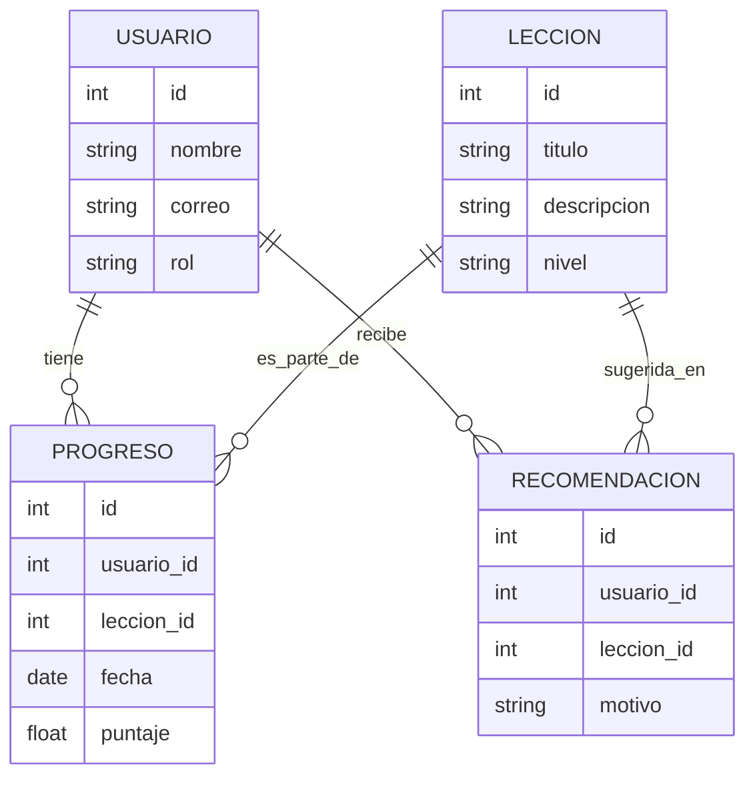

# Esquema de Base de Datos para LEXI

## Entidades Principales
- **USUARIO**: id, nombre, correo, rol
- **LECCION**: id, titulo, descripcion, nivel
- **PROGRESO**: id, usuario_id, leccion_id, fecha, puntaje
- **RECOMENDACION**: id, usuario_id, leccion_id, motivo

## Diagrama ER

## Descripción
El modelo permite registrar usuarios, lecciones, el progreso de cada usuario en cada lección y recomendaciones personalizadas. Así, LEXI puede ofrecer aprendizaje adaptativo, seguimiento y motivación personalizada.
