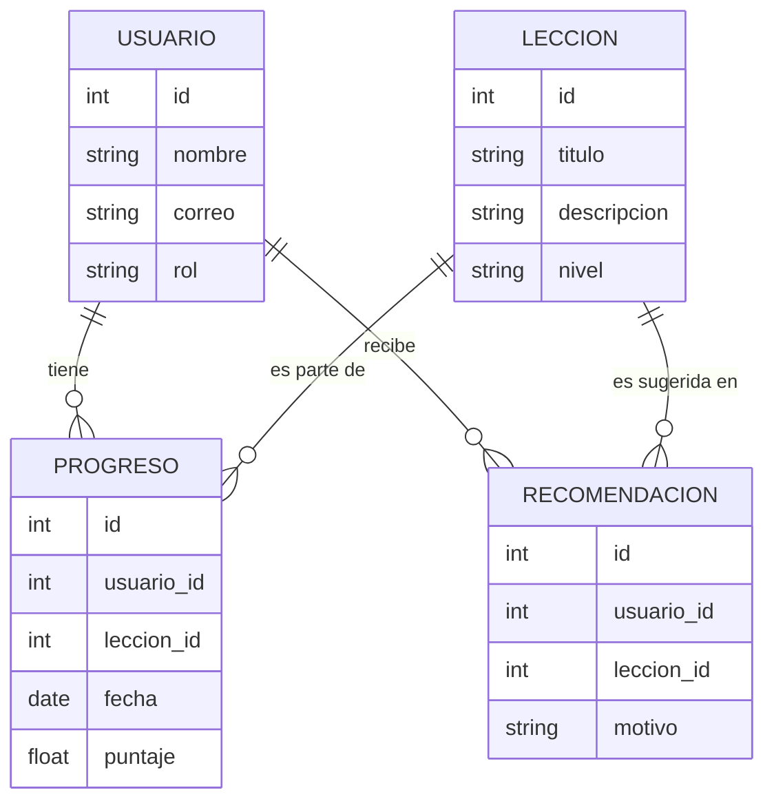

# Plantilla de Esquema de Base de Datos

_¿Cuáles son las entidades principales y relaciones en tu modelo de datos?_

---

## Diagrama ER

<small>(Diagrama adaptado para LEXI. Amplía según crezcan tus requerimientos.)</small>

---

## Descripción

En LEXI, los usuarios pueden avanzar a través de lecciones y su progreso se registra para personalizar la experiencia de aprendizaje. Cada usuario tiene un historial de progreso asociado a diferentes lecciones, con puntajes y fechas. El sistema genera recomendaciones personalizadas de nuevas lecciones para cada usuario, basadas en su historial y desempeño. Las entidades principales son:

- **USUARIO:** Representa a cada persona registrada en la plataforma.
- **LECCION:** Unidades de aprendizaje disponibles.
- **PROGRESO:** Registro de avance de cada usuario en cada lección, incluyendo puntaje y fecha.
- **RECOMENDACION:** Sugerencias de lecciones personalizadas para cada usuario, con el motivo de la recomendación.

Esta estructura permite funcionalidades como mostrar el historial de aprendizaje, sugerir nuevas lecciones y adaptar la experiencia a cada usuario.

<small>Agrega más entidades y relaciones a medida que tu proyecto crezca.</small>
